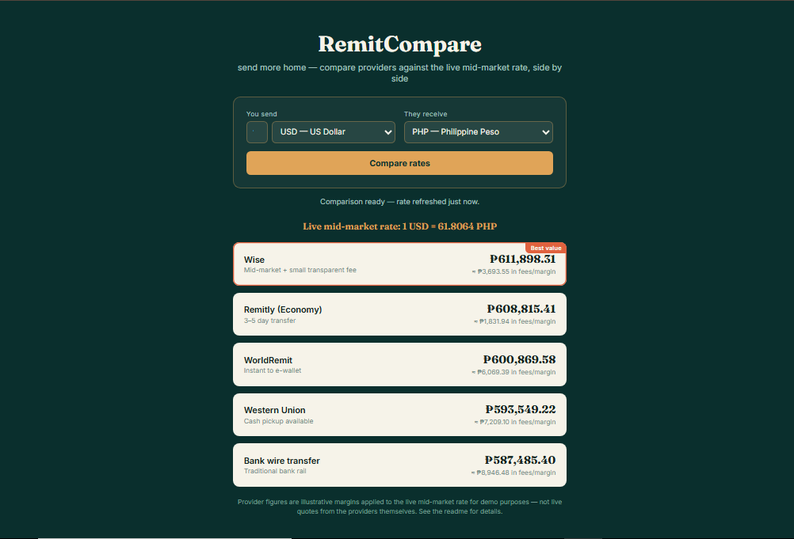

# RemitCompare — Live Remittance Rate Comparison

A side-by-side comparison of what different money-transfer providers would give a recipient, built on top of the live mid-market exchange rate — not just a spot converter, but the tool an OFW or diaspora sender would actually want before choosing where to send money.

**[Live demo →](https://arjayb.github.io/RemitCompare/)**



## Features

- Live mid-market exchange rate for any supported currency pair
- Side-by-side provider comparison, sorted by best net amount received
- Common corridors pre-loaded (PHP, USD, AED, SGD, SAR, HKD) for OFW/diaspora remittance use cases
- Clear "best value" badge and transparent fee breakdown per provider
- No backend, no login, no API key required

## Why the provider numbers are modeled

Remittance providers don't expose free, CORS-open rate APIs, so a browser-only app can't call them directly the way it can call a public exchange-rate API. This demo applies a set of **illustrative, clearly-labeled margins and fees** on top of the live mid-market rate to approximate each provider's likely offer — it does not call the providers directly, and the app discloses this in the UI itself, not just here.

**Turning this into a production tool** means replacing `PROVIDER_PROFILES` in `script.js` with real partner-API integrations or a licensed rate-aggregation feed. The mid-market rate everything is built on, however, is live and real.

## Run it locally

Clone the repo and open `index.html` in a browser. No build step, no `npm install`.

```bash
git clone https://github.com/arjayb/RemitCompare.git
cd RemitCompare
open index.html   # or just double-click it
```

If your browser blocks `fetch` on the `file://` protocol, serve it with any static server instead:

```bash
python3 -m http.server 8000
# then visit http://localhost:8000
```

## Deploy to GitHub Pages

1. Push this repo to GitHub.
2. Go to **Settings → Pages**.
3. Under **Build and deployment**, set **Source** to `Deploy from a branch`, pick `main` and `/ (root)`.
4. Save — your app will be live at `https://<your-username>.github.io/RemitCompare/` within a minute or two.

## Project structure

```
RemitCompare/
├── index.html    # markup
├── style.css     # comparison layout, best-value badge, fee breakdown
├── script.js     # live mid-market rate call, provider margin modeling, ranking
└── README.md
```

## Data source

The mid-market exchange rate comes from [open.er-api.com](https://www.exchangerate-api.com/), a free, keyless exchange-rate API. Provider figures are computed client-side from that rate using modeled margins in `PROVIDER_PROFILES` — see "Why the provider numbers are modeled" above. No authentication, no API key, no user data is stored.

## License

MIT — use this however you'd like.
